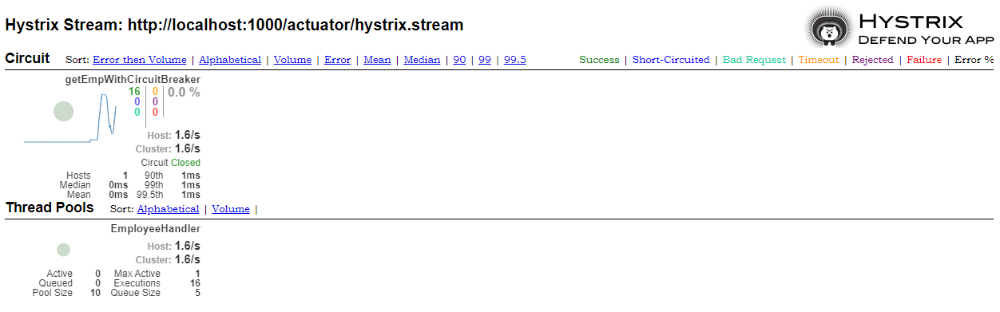
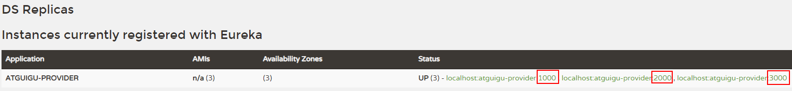

# 1.eureka
## 1. eureka 服务端配置
### 1.1 pom 配置
```xml
<dependency>
    <groupId>org.springframework.cloud</groupId>
    <artifactId>spring-cloud-starter-netflix-eureka-server</artifactId>
</dependency>
```

### 1.2 主启动类
在主启动类上加上 **@EnableEurekaServer** 注解。
```java
@EnableEurekaServer
@SpringBootApplication
public class AtguiguMainType {
    public static void main(String[] args) {
        SpringApplication.run(AtguiguMainType.class, args);
    }
}
```

### 1.3 yml 配置
```yml
server:
  port: 5000

eureka:
  instance:
    hostname: localhost         # 配置当前Eureka服务的主机地址
  client:
    register-with-eureka: false # 当前服务本身就是注册中心，不必“自己注册自己”
    fetch-registry: false       # 当前服务本身就是注册中心，不必“从注册中心取回信息”
    service-url:                # 客户端（指consumer、provider）访问当前注册中心时使用的地址
      defaultZone: http://${eureka.instance.hostname}/${server.port}/eureka
```
> *在配置文件中点击标签，可以进入它们对应的定义的地方。*

## 2. eureka 客户端配置（provider）
### 2.1 pom 配置
```xml
<dependency>
    <groupId>org.springframework.cloud</groupId>
    <artifactId>spring-cloud-starter-netflix-eureka-client</artifactId>
</dependency>
```
### 2.2 yml 配置
```yml
server:
  port: 1000

spring:
  application:
    name: atguigu-provider # 当前微服务的名称。必须配置，才能通过微服务名称调用微服务。

eureka:
  client:
    service-url: # 配置当前微服务作为Eureka客户端访问Eureka服务器端时使用的地址
      defaultZone: http://localhost:5000/eureka
```
> *低版本的eureka，还需要在客户端项目主启动类上配 @EnableEurekaClient 注解。但高版本(D版本之后)不用配置了。*

## 3. eureka 客户端配置（consumer）
### 3.1 pom 配置
```xml
<dependency>
    <groupId>org.springframework.cloud</groupId>
    <artifactId>spring-cloud-starter-netflix-ribbon</artifactId>
</dependency>
<dependency>
    <groupId>org.springframework.cloud</groupId>
    <artifactId>spring-cloud-starter-netflix-eureka-client</artifactId>
</dependency>
```
### 3.2 yml 配置
```yml
server:
  port: 4000
spring:
  application:
    name: atguigu-consumer
eureka:
  client:
    service-url:
      defaultZone: http://localhost:5000/eureka    
```
### 3.3 java 配置

在调用处，**修改目标url为对应微服务的名称。**  
并在 RestTemplate 定义处加上 **@LoadBalanced** 注解。这会使得 RestTemplate 客户端具备负载均衡功能，通过调用 Ribbon 访问 Provider 集群。  
访问集群时，路径为：consumer -> ribbon(得到微服务名称) -> eureka -> provider。
```java
@Bean
@LoadBalanced
public RestTemplate getRestTemplate() {
    return new RestTemplate();
}
```

# 2. Feign
## 1.配置
- common 服务中，引入 Feign 依赖。consumer依赖了common，不必引入依赖。
- 在 common 服务中，接口上加上注解 **@FeignClient("provider中的服务名")**，且接口中的抽象方法签名，必须和这个服务中存在的对应的方法声明和 @RequestMapping() 路径都一致，获取请求参数的@RequestParam/@PathVariable/@RequestBody也要一致。且目标微服务中的方法必须有具体实现。
- 在 consumer 中，主启动类上加上 **@EnableFeignClients** 注解。在需要的地方装配上面的接口，然后调用对应的方法即可。

# 3. Hystrix
## 1. 配置（provider端服务熔断）
1. provider 中引入 hystrix。
2. provider 主启动类上加上 **@EnableCircuitBreaker** 注解开启断路器。
3. provider 的 controller 中，在需要备份的 handler 方法上加上 **@HystrixCommand(fallbackMethod = "getEmpWithCircuitBreakerBackup")** 注解。其中，getEmpWithCircuitBreakerBackup 指的是备用的方法名。它的参数、返回值必须和当前方法一致。备用方法不需要注解。
4. 设置返回类型。使得前台可分辨是成功或失败。具体见*补充内容*章节。

## 2. 配置（consumer/common端服务降级）
1. common 中引入 hystrix。
2. common 中创建类，实现 FallbackFactory<EmployeeRemoteService> 接口，方法中，返回泛型对象（匿名内部类）。**EmployeeRemoteService** 这个泛型类，是 consumer 中 **@FeignClient** 注解对应的接口。
3. common 中 **@FeignClient** 注解需要修改，添加 fallbackFactory属性。它的值和上一步创建的类名一致。如下：
```java
@FeignClient(value = "atguigu-provider", fallbackFactory = MyFallBackFactory.class)
```
4. 在 consumer 端的 **application.yml** 中启用降级。
```yml
feign:
  hystrix:
    enabled: true
```
5. 调用 provider 失败后，会调用这个匿名内部类中对象的对应方法。
> 可参考如下代码：
```java
@Component
public class MyFallBackFactory implements FallbackFactory<EmployeeRemoteService>{

    @Override
    public EmployeeRemoteService create(Throwable cause) {
        // TODO Auto-generated method stub
        return new EmployeeRemoteService() {
            
            @Override
            public Employee getEmployeeRemote() {
                return null;
            }

            @Override
            public ResultEntity<Employee> getEmpWithCircuitBreaker(String signal) {
                return ResultEntity.failed(cause.getMessage());
            }
        };
    }
}
```
# 4. actuator（监控）
## 1. 配置
1. provider 中引入 actuator。
```xml
<dependency>
  <groupId>org.springframework.boot</groupId>
  <artifactId>spring-boot-starter-actuator</artifactId>
</dependency>
```
2. 配置 provider 的 application.yml
```yml
management:
  endpoints:
    web:
      exposure:
        include: hystrix.stream
```
## 2. 新创建一个监控的工程。
### 2.1 配置
1. 引入 hystrix-dashboard
2. 主启动类加上 **@EnableHystrixDashboard** 注解，开启 hystrix 仪表盘功能。
3. 在 yml 中配置端口号、服务名
```yml
server:
  port: 8000
spring:
  application:
    name: atguigu-dashboard
```
### 2.2 使用
1. 启动服务，访问 localhost:8000/hystrix。进入hystrix首页。此时可以看到豪猪logo。

2. 访问 localhost:1000/actutor/hystrix.stream，即 provider 服务的 监控信息。这个页面会持续刷新。

3. 把第2条中的url填入第1条中打开的页面中，点击按钮。之后访问几次 localhost:1000/provider/get/emp/with/circuit/breaker?signal=q222，即可看到最终效果。如下图：

   

# 5. Zuul 网关
## 1. 新建一个网关工程
### 1.1 配置
1. 引入依赖。
```xml
<dependency>
    <groupId>org.springframework.cloud</groupId>
    <artifactId>spring-cloud-starter-netflix-eureka-client</artifactId>
</dependency>
<dependency>
    <groupId>org.springframework.cloud</groupId>
    <artifactId>spring-cloud-starter-netflix-zuul</artifactId>
</dependency>
```
2. 配置 provider 的 application.yml。端口号、服务名、eureka url。
```yml
server:
  port: 9000

spring:
  application:
    name: zuul-gateway

eureka:
  client:
    service-url:
      defaultZone: http://localhost:5000/eureka/
```
3. 主启动类加上 **@EnableZuulProxy** 注解，启用 Zuul 代理功能。
### 1.2 访问
```
http://localhost:9000/aituigu-feign-consumer/feign/consumer/get/emp
即，Zuul 网关 + 目标微服务名称 + 目标微服务具体功能地址
```
### 1.3 其他配置
1. 配置服务别名，通过 zuul 访问服务时，url 中拼接别名，可以避免服务名暴露。
在 zuul 服务的 yml 中做以下配置：
```yml
zuul:
  routes:
    employee:
      service-id: atguigu-feign-consumer
      path: /zuul-emp/**
```
其中，employee 可以自定义。在底层，它是 map 中的 key。
path 值中的 **/\*\*** 表示可以匹配多层路径。完成后，就可以用别名访问微服务了。  
2. 通过以下配置，可以禁用通过服务名访问，只能通过别名访问。其中，'*' 可以替换成具体的服务名，以 - 开头，代表是一个集合。  
```yml
zuul:
  ignored-services: '*'
```
3. 通过以下配置，可以给访问路径添加统一前缀。
```yml
zuul:
  prefix: /mm
```

## 2. ZuulFilter

><i>todo</i>

# 6. 补充内容
## 6.1 **@EnableDiscoveryClient / @EnableEurekaClient** 注解
- @EnableDiscoveryClient: 该注解的作用是启用发现服务功能。用在微服务的启动类上。不局限于eureka注册中心。
- @EnableEurekaClient: 作用相同，但只能在eureka注册中心使用。D版本以后可以省略。

## 6.2 同一个微服务以集群的方式启动
在主启动类处启动微服务。启动完毕后，修改端口号，再启动。这时查看 eureka，看到类似下图的效果则说明启动成功。


> 只能修改端口号，不能修改服务名。否则就不是一个集群。

## 6.3 Feign 会依赖 ribbon。因此如果引入了 Feign，不用再单独引入 ribbon 了。

## 6.4 如何得到 HttpServletRequest 的对象？
在springmvc中，可以通过在方法上添加参数的方式得到这个对象，在其他场景下，可通过以下代码获取：
```java
RequestContext currentContext = RequestContext.getCurrentContext();
HttpServletRequest request = currentContext.getRequest();
```